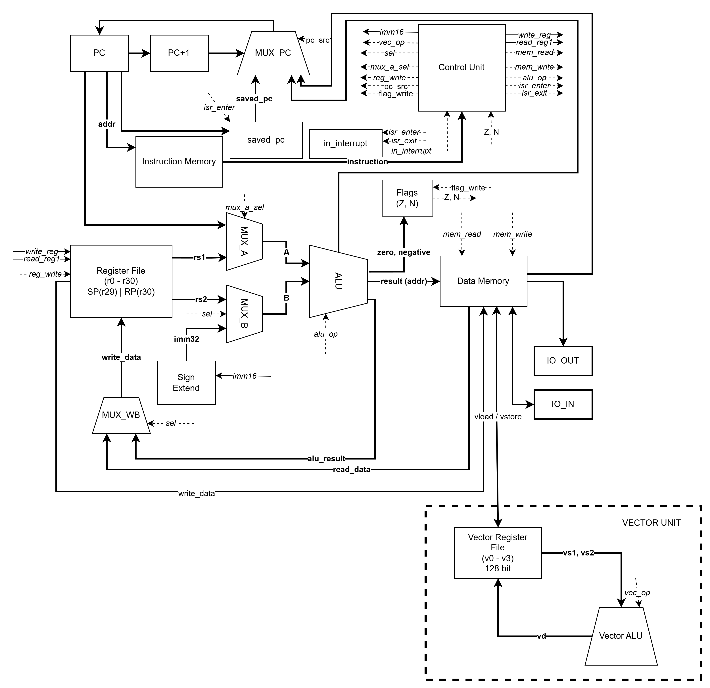
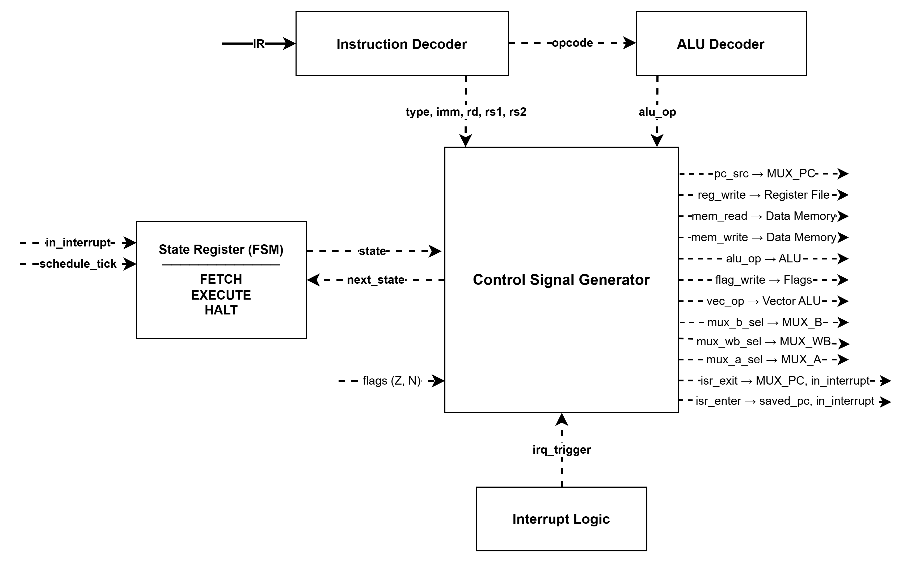

# Лабораторная работа №4. Эксперимент

**Выполнила:** Шмидько Елизавета, P3232

**Вариант:** `forth | risc | harv | hw | tick | binary | trap | mem | pstr | prob2 | vector`

---

## Язык программирования

### Общая характеристика

Реализован минималистичный диалект Forth. Стековая машина, все данные — 32-битные знаковые целые.

Язык поддерживает:
- процедуры (`: name ... ;`);
- условные ветвления (`if`/`else`/`then`);
- циклы (`begin`/`until`, `begin`/`while`/`repeat`);
- переменные (`variable`);
- строки в формате Pascal (`." text"`);
- обработчики прерываний (`interrupt:`);
- встроенные слова для арифметики, стека, памяти, ввода-вывода.

### Синтаксис (BNF)

```
program     ::= { definition | directive | statement }
definition  ::= ":" name { statement } ";"
directive   ::= "variable" name | "interrupt:" name
statement   ::= word | number | string_lit
              | "if" { statement } [ "else" { statement } ] "then"
              | "begin" { statement } "until"
              | "begin" { statement } "while" { statement } "repeat"
string_lit  ::= '."' text '"'
number      ::= [ "-" ] digit { digit }
name        ::= letter { letter | digit | "-" | "?" }
```


### Семантика

- Стратегия вычислений стековая, RPN. `3 4 + 2 *` → стек: `[14]`.
- Области видимости глобальные. Все `variable` и `:` видны везде после объявления.
- Типизации нет. Всё — 32-битные знаковые целые. `0` — ложь, остальное — истина.
- Литералы числовые (`42`, `-7`, `4000000`) и строковые (`." Hello"` — Pascal-строка в секции данных).

### Встроенные слова

| Слово | Стек (до → после) | Действие |
|-------|-------------------|----------|
| `+` `-` `*` `/` `mod` | `a b → r` | арифметика |
| `and` `or` `xor` | `a b → r` | побитовые операции |
| `=` `<` `>` `<=` `>=` | `a b → 0/1` | сравнение |
| `0=` `not` | `a → 0/1` | инверсия |
| `dup` | `a → a a` | дублировать |
| `drop` | `a →` | удалить |
| `swap` | `a b → b a` | поменять местами |
| `over` | `a b → a b a` | скопировать второй |
| `rot` | `a b c → b c a` | ротация |
| `nip` | `a b → b` | удалить второй |
| `2dup` | `a b → a b a b` | дублировать пару |
| `2drop` | `a b →` | удалить пару |
| `@` | `addr → val` | читать из памяти |
| `!` | `val addr →` | записать в память |
| `emit` | `char →` | вывести символ |
| `key` | `→ char` | читать символ из порта ввода |
| `>r` | `a →` | положить на стек возвратов |
| `r>` | `→ a` | снять со стека возвратов |
| `r@` | `→ a` | копировать вершину стека возвратов |
| `halt` | — | остановка |
| `iret` | — | возврат из обработчика прерывания |

### Пример выполнения

```forth
: square  dup * ;
: main    5 square __print_int halt ;
```

Трассировка стека:

| Шаг | Слово | Стек |
|-----|-------|------|
| 1 | `5` | `[5]` |
| 2 | `square` → `dup` | `[5 5]` |
| 3 | `*` | `[25]` |
| 4 | `__print_int` | `[]` → выводит `25` |
| 5 | `halt` | остановка |

---

## Организация памяти

### Общая модель

Гарвардская архитектура: память команд и память данных физически разделены. Каждая — однопортовая, 65536 × 32 бит. Машинное слово — 32 бита, знаковое. Адресация — пословная.

### Регистры

```
Scalar registers (32 × 32 bit):
+------+----------+------------------------------------------+
| r0   | TMP0     | временный (транслятор)                   |
| r1   | TMP1     | временный                                |
| r2   | TMP2     | временный                                |
| r3   | TMP3     | временный                                |
| r4   | TMP4     | индекс do-цикла                          |
| r5   | TMP5     | предел do-цикла                          |
| r6–r12 |        | временные (буферы процедур)              |
| r13  | ZERO_REG | всегда 0 (для сравнений)                 |
| r14–r28 |       | временные общего назначения              |
| r29  | SP       | stack pointer стека данных Forth         |
| r30  | RP       | stack pointer стека возвратов            |
+------+----------+------------------------------------------+
flags: Z (zero), N (negative) — устанавливаются CMP и SUB

Vector registers (4 × 128 bit):
+----+------------------------------+
| v0 | 4 элемента по 32 бит         |
| v1 |                              |
| v2 |                              |
| v3 |                              |
+----+------------------------------+
```

### Память команд

```
Instruction memory (65536 × 32 bit)
+-------------------------------+
| 0x0000 : jmp <main>           |  точка входа
| 0x0001 : li r0, <handler>    |  адрес обработчика прерываний
| 0x0002 : начало __print_pstr  |  встроенные процедуры транслятора
|   ...                         |
| 0x00NN : начало __print_int   |
|   ...                         |
| 0x00MM : пользовательские     |  процедуры пользователя в порядке
|          процедуры            |  объявления
|   ...                         |
| 0x00KK : main                 |  точка входа пользователя
+-------------------------------+
```

### Память данных

```
Data memory (65536 × 32 bit)
+-------------------------------+
| 0x0000 : зарезервировано      |
| 0x0001 : вектор прерываний    |  адрес обработчика прерывания
| 0x0002–0x000F : зарезервировано
| 0x0010 : статические данные   |  строки и переменные (растут вверх)
|   ...  : pstr литерал 1       |  [длина][char0][char1]...
|   ...  : pstr литерал 2       |  следующий литерал после предыдущего
|   ...  : variable 1           |  одно слово на переменную
|   ...  : variable 2           |
|   ...                         |
| 0x0100–0x01FE : стек данных   |  стек Forth (растёт вниз от 0x01FF)
| 0x01FF : вершина стека данных |  SP инициализируется здесь
| 0x0200–0x02FE : стек возвратов|  (растёт вниз от 0x02FF)
| 0x02FF : вершина ret-стека    |  RP инициализируется здесь
| 0x0300–... : буфер цифр       |  используется __print_int
|   ...                         |
| 0xFFFE : порт ввода           |  memory-mapped IO_IN_ADDR
| 0xFFFF : порт вывода          |  memory-mapped IO_OUT_ADDR
+-------------------------------+
```

### Размещение объектов языка

**Числовые литералы.** Если значение в диапазоне ±32767 — непосредственная адресация `li rd, imm` (1 инструкция). Большие числа (например `4000000`) кодируются двумя инструкциями: `lui rd, upper16` + `addi rd, rd, lower16`. В статическую память не сохраняются.

**Строковые литералы** (`." text"`) — Pascal-строки в статической секции данных. Формат: первое слово — длина, затем по одному символу на слово. Адрес фиксируется при трансляции. Строки размещаются последовательно, в порядке появления в коде.

**Переменные** (`variable name`) — одно слово в статической памяти, начиная с адреса `0x0010`. В регистры не отображаются. Обращение: `name` кладёт адрес на стек, `@` читает, `!` записывает.

**Инструкции** в памяти команд, 32 бита, размещаются последовательно в порядке трансляции.

**Процедуры** в памяти команд, завершаются `ret`. Адрес начала сохраняется в таблице меток. Вызов через `call`, возврат через `ret`. Стек возвратов — в памяти данных (`0x0200–0x02FF`).

**Прерывания**. Адрес обработчика хранится в `data_mem[1]` (вектор прерываний). Обработчик объявляется через `interrupt: name`, завершается `iret`.

---

## Система команд

RISC архитектура. Фиксированная длина инструкции 32 бита, все арифметические операции только над регистрами, доступ к памяти отдельными командами `load`/`store`.

### Форматы инструкций

**R-тип** — операции регистр–регистр:
```
 31      26 25   21 20   16 15   11 10        0
+----------+-------+-------+-------+-----------+
|  opcode  |  rd   |  rs1  |  rs2  |  unused   |
|  6 бит   | 5 бит | 5 бит | 5 бит |  11 бит   |
+----------+-------+-------+-------+-----------+
```

**I-тип** — immediate, память, переходы:
```
 31      26 25   21 20   16 15              0
+----------+-------+-------+----------------+
|  opcode  |  rd   |  rs1  |    imm16       |
|  6 бит   | 5 бит | 5 бит |   16 бит      |
+----------+-------+-------+----------------+
```

**V-тип** — векторные операции:
```
 31      26 25 24 23 22 21 20 19           0
+----------+-----+-----+-----+-------------+
|  opcode  | vd  | vs1 | vs2 |   unused    |
|  6 бит   |2 бит|2 бит|2 бит|   20 бит   |
+----------+-----+-----+-----+-------------+
```

### Набор инструкций

| Опкод | Мнемоника | Тип | Такты | Действие |
|-------|-----------|-----|-------|----------|
| 0 | `add rd, rs1, rs2` | R | 2 | rd = rs1 + rs2 |
| 1 | `sub rd, rs1, rs2` | R | 2 | rd = rs1 − rs2; set Z,N |
| 2 | `mul rd, rs1, rs2` | R | 2 | rd = rs1 × rs2 |
| 3 | `div rd, rs1, rs2` | R | 2 | rd = rs1 / rs2 |
| 4 | `mod rd, rs1, rs2` | R | 2 | rd = rs1 % rs2 |
| 5 | `and rd, rs1, rs2` | R | 2 | rd = rs1 & rs2 |
| 6 | `or rd, rs1, rs2` | R | 2 | rd = rs1 \| rs2 |
| 7 | `xor rd, rs1, rs2` | R | 2 | rd = rs1 ^ rs2 |
| 8 | `shl rd, rs1, rs2` | R | 2 | rd = rs1 << rs2 |
| 9 | `shr rd, rs1, rs2` | R | 2 | rd = rs1 >> rs2 |
| 10 | `cmp rs1, rs2` | R | 2 | set Z,N по rs1−rs2 |
| 11 | `mov rd, rs1` | R | 2 | rd = rs1 |
| 12 | `li rd, imm` | I | 2 | rd = sign_extend(imm16) |
| 13 | `addi rd, rs1, imm` | I | 2 | rd = rs1 + sign_extend(imm16) |
| 14 | `load rd, imm(rs1)` | I | 2 | rd = mem[rs1 + imm] |
| 15 | `store rd, imm(rs1)` | I | 2 | mem[rs1 + imm] = rd |
| 16 | `jmp imm` | I | 2 | pc = imm |
| 17 | `jz imm` | I | 2 | if Z: pc = imm |
| 18 | `jnz imm` | I | 2 | if !Z: pc = imm |
| 19 | `jn imm` | I | 2 | if N: pc = imm |
| 20 | `call imm` | I | 2 | mem[--rp] = pc; pc = imm |
| 21 | `ret` | I | 2 | pc = mem[rp++] |
| 22 | `halt` | I | 1 | остановка |
| 23 | `iret` | I | 2 | pc = saved_pc; in_interrupt = false |
| 24 | `vadd vd, vs1, vs2` | V | 2 | vd[i] = vs1[i] + vs2[i] |
| 25 | `vsub vd, vs1, vs2` | V | 2 | vd[i] = vs1[i] − vs2[i] |
| 26 | `vmul vd, vs1, vs2` | V | 2 | vd[i] = vs1[i] × vs2[i] |
| 27 | `vdiv vd, vs1, vs2` | V | 2 | vd[i] = vs1[i] / vs2[i] |
| 28 | `vcmp vd, vs1, vs2` | V | 2 | vd[i] = (vs1[i]==vs2[i]) ? 1 : 0 |
| 29 | `vload vd, imm(rs)` | V | 2 | vd[0..3] = mem[rs+imm .. rs+imm+3] |
| 30 | `vstore vd, imm(rs)` | V | 2 | mem[rs+imm .. rs+imm+3] = vd[0..3] |
| 31 | `lui rd, imm` | I | 2 | rd = imm16 << 16 |

Полный цикл выполнения инструкции — 2 такта: 1 такт fetch + 1 такт execute. `halt` — 1 такт.

---

## Система прерываний и trap

### Общая идея

Ввод-вывод осуществляется через систему прерываний (trap). При старте модели задаётся расписание ввода вида `[(tick, char), ...]`. В начале каждого такта модель проверяет расписание и при наступлении события записывает символ в порт `0xFFFE` и инициирует прерывание.

### Порты ввода-вывода (memory-mapped)

| Адрес | Назначение |
|-------|------------|
| `0xFFFE` | порт ввода — `load` читает символ и сбрасывает порт в 0 |
| `0xFFFF` | порт вывода — `store` выводит символ в буфер |

Адреса задаются константами `IO_IN_ADDR` и `IO_OUT_ADDR` в `isa.py`.

### Последовательность обработки прерывания

1. В такт `T` симулятор записывает символ в `data_mem[0xFFFE]`
2. Если `in_interrupt = false`: `saved_pc = pc`, `in_interrupt = true`, `pc = data_mem[1]`
3. Обработчик читает символ через `key` (`load` из `0xFFFE`)
4. Обработчик завершается `iret`
5. `iret`: `pc = saved_pc`, `in_interrupt = false`

Вложенные прерывания маскируются: если `in_interrupt = true`, новые прерывания игнорируются до `iret`.

### Пример обработчика

```forth
interrupt: handle_input

: handle_input
    key emit
    iret
;
```

### Журнал прерываний

В журнале прерывания и возвраты отмечены явно:

```
  [INTERRUPT tick=10] char='h' -> handler@0034
tick=    11  [ISR]  pc=0034 | addi r29, r29, 1  | r0=0 ... Z=0 N=0
  ...
  [IRET tick=55] returning to pc=0050
```

---

## Vector extension

### Программная модель

- Векторные регистры: `v0`–`v3`
- Ширина регистра: 4 элемента × 32 бит = 128 бит
- Операции выполняются поэлементно над всеми 4 элементами за 1 такт execute

### Инструкции

| Инструкция | Действие |
|-----------|---------|
| `vload vd, addr` | загрузить 4 слова из памяти в `vd` |
| `vstore vd, addr` | сохранить 4 слова из `vd` в память |
| `vadd vd, vs1, vs2` | `vd[i] = vs1[i] + vs2[i]` |
| `vsub vd, vs1, vs2` | `vd[i] = vs1[i] - vs2[i]` |
| `vmul vd, vs1, vs2` | `vd[i] = vs1[i] * vs2[i]` |
| `vdiv vd, vs1, vs2` | `vd[i] = vs1[i] / vs2[i]` |
| `vcmp vd, vs1, vs2` | `vd[i] = 1 если vs1[i]==vs2[i] иначе 0` |

### Синтаксис в Forth

```forth
vload,v0,512        ( загрузить 4 слова начиная с адреса 512 в v0 )
vload,v1,516        ( загрузить следующие 4 слова в v1 )
vadd,v2,v0,v1       ( v2[i] = v0[i] + v1[i] )
vstore,v2,520       ( сохранить v2 начиная с адреса 520 )
```

### Сравнение производительности

Для сложения двух массивов `[10,20,30,40]` и `[50,60,70,80]`:

| Реализация | Инструкций | Тактов |
|-----------|-----------|--------|
| Скалярная | ~60 | ~250 |
| Векторная (vload+vload+vadd+vstore) | 4 | ~16 |
| Ускорение | — | **~15x** |

В журнале видно:

```
tick=  1147  pc=00b2 | vload v0, 0(r0) | r0=512 ...
tick=  1151  pc=00b4 | vload v1, 0(r0) | r0=516 ...
tick=  1153  pc=00b5 | vadd v2, v0, v1 | ...
tick=  1157  pc=00b7 | vstore v2, 0(r0)| r0=520 ...
```

---

## Транслятор

### Интерфейс командной строки

```
python translator.py <source.forth> <output.bin> [output.dbg]
```

| Аргумент | Описание |
|---------|---------|
| `source.forth` | исходный код на Forth |
| `output.bin` | бинарный файл машинного кода |
| `output.dbg` | отладочный файл с мнемониками (по умолчанию `output.bin.dbg`) |

### Этапы трансляции

1. **Токенизация**. Разбивка текста на токены, удаление комментариев, выделение строковых литералов.

2. **Однопроходная компиляция**. Каждый токен немедленно генерирует инструкции:
   - `: name ... ;` — фиксирует адрес начала, компилирует тело, добавляет `ret`
   - `variable name` — выделяет слово в статической памяти данных
   - `interrupt: name` — запоминает имя обработчика прерывания
   - числа — `li` (±32767) или `lui`+`addi` (большие)
   - слова — `call addr` с записью в fixup-список при неизвестном адресе

3. **Разрешение forward-ссылок**. После компиляции подставляем адреса из fixup-списка.

4. **Запись бинарного файла**  big-endian 32-бит слова:
   ```
   [4 байта] N — количество инструкций
   [N × 4 байта] инструкции
   [4 байта] M — количество слов данных
   [M × 4 байта] данные
   ```

### Формат отладочного файла

```
=== INSTRUCTION MEMORY ===
0000 - 40000034 - jmp 52
0001 - 30000000 - li r0, 0
0002 - A6000000 - addi r29, r29, 1
...
=== DATA MEMORY ===
0000 - 00000000
0001 - 00000034
0010 - 0000000D
0011 - 00000048
...
```

---

## Модель процессора

### Интерфейс командной строки

```
python machine.py <program.bin> [input.txt] [log.txt]
```

| Аргумент | Описание |
|---------|---------|
| `program.bin` | бинарный файл из транслятора |
| `input.txt` | расписание ввода (опционально) |
| `log.txt` | файл журнала (опционально) |

Если передан один дополнительный аргумент с расширением `.log`, то он трактуется как лог. Иначе — как файл ввода.

### Формат файла ввода

```
100 'A'
200 65
300 \n
400 \0
```

Каждая строка: `<такт> <символ>`. Символ в кавычках, числом или спецсимволом (`\n`, `\0`).

### DataPath




### ControlUnit



### Управляющие сигналы

| Сигнал      | Назначение |
|-------------|-----------|
| `reg_write` | запись результата в регистровый файл |
| `mem_read`  | чтение из data_mem |
| `mem_write` | запись в data_mem |
| `alu_op`    | код операции ALU |
| `pc_src`    | выбор следующего PC: pc+1, imm, ret_addr, saved_pc |
| `flag_write` | обновление Z, N |
| `vec_op`    | код векторной операции |
| `isr_enter` | вход в обработчик прерывания |
| `isr_exit`  | выход через iret |

### Особенности реализации

- **Tick-accurate**: каждая инструкция — 2 такта (fetch + execute), `halt` — 1 такт.
- **Гарвардская архитектура**: `instr_mem` и `data_mem` — независимые массивы Python.
- **Hardwired CU**: логика декодирования реализована как цепочка `if/elif` по опкоду — прямое отражение комбинационной схемы дешифратора.
- **FSM**: процессор имеет три состояния — FETCH (выборка инструкции), EXECUTE (выполнение), HALT (останов). FETCH и EXECUTE реализованы как последовательные вызовы `fetch_decode()` и `execute()` внутри цикла `while`. HALT — терминальное состояние, достигается через исключение `HaltException` при выполнении инструкции `halt`.
- Стек данных Forth — `data_mem[0x0100–0x01FF]`, SP инициализируется в `0x01FF`.
- Стек возвратов — `data_mem[0x0200–0x02FF]`, RP инициализируется в `0x02FF`.
- Журнал ограничен 500 строками.

---

## Тестирование

### Golden tests

| Тест | Программа | Ввод | Ожидаемый вывод |
|------|-----------|------|-----------------|
| `test_hello` | `programs/hello.forth` | — | `Hello, World!` |
| `test_cat` | `programs/cat.forth` | `hello` побуквенно | `hello` |
| `test_hello_user_name` | `programs/hello_user_name.forth` | `Alice\0` | `What is your name?\nHello, Alice!\n` |
| `test_sort` | `programs/sort.forth` | длина + 5 чисел | числа по возрастанию |
| `test_prob2` | `programs/prob2.forth` | `4000000\n` | `4613732` |
| `test_double_precision` | `programs/double_precision.forth` | — | `0 -1794967296` |
| `test_vector_demo` | `programs/vector_demo.forth` | — | `60 80 100 120\n60 80 100 120` |
| `test_harvard_memory` | `golden_tests/hello/hello.dbg` | — | обе секции памяти в dbg-файле |

Все golden tests хранятся в `golden_tests/<name>/` и включают: `.forth`, `.bin`, `.dbg`, `.log`, `input.txt` (где нужен).

### Демонстрация особенностей варианта

**trap — прерывания:**

Предел для prob2 передаётся посимвольно через прерывания:
```
golden_tests/prob2/input.txt:
100 '4'
200 '0'
...
800 \n
```
Обработчик собирает цифры в переменную `limit`, затем вычисляется сумма.

**pstr — Pascal-строки:**

`." Hello, World!"` хранится в памяти данных как `[13][H][e][l][l][o][,][ ][W][o][r][l][d][!]`. Вывод через `__print_pstr`.

**vector — сравнение тактов:**

`programs/vector_demo.forth` — скалярная реализация ~250 тактов, векторная ~16 тактов, ускорение **~15x**.

### Запуск тестов

```bash
pytest test_golden.py -v
ruff check isa.py translator.py machine.py test_golden.py
```

---

## Пример использования инструментальной цепочки

```bash
# Трансляция
python translator.py programs/hello.forth out/hello.bin out/hello.dbg

# Запуск без лога
python machine.py out/hello.bin
# Hello, World!

# Запуск с сохранением лога
python machine.py out/hello.bin out/hello.log

# Запуск с вводом и логом
python machine.py out/prob2.bin golden_tests/prob2/input.txt out/prob2.log
# 4613732

# Запуск cat с вводом через прерывания
python machine.py out/cat.bin golden_tests/cat/input.txt
# hello
```